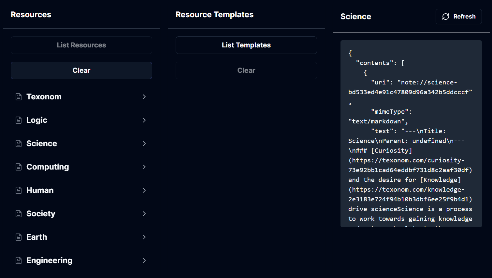
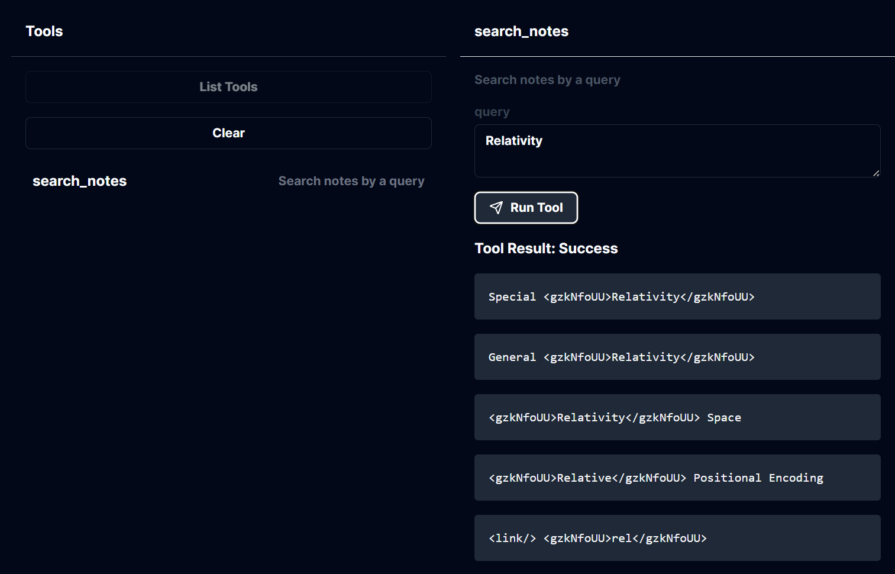
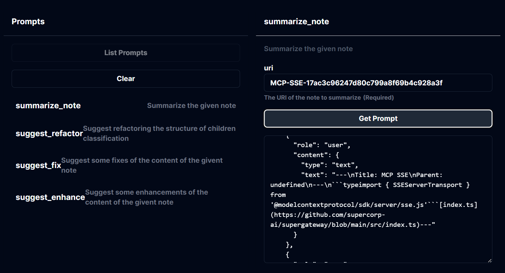

# MCP Server: Notion-Texonom

**Markdown based Notion navigating MCP with just a single `ROOT_PAGE` variable, eliminating the need for a token.**

- Notion pages are converted into `text/markdown` mimeType notes.
- Search and retrieve relevant pages based on graph distance, considering parent-child and reference relationships.

A Model Context Protocol (MCP) server for managing and interacting with Notion-based notes. This TypeScript-based server demonstrates MCP concepts by integrating resources, tools, and prompts to interact with Notion pages efficiently.

## Features

### Resources



- **Access Notes**: List and retrieve Notion pages as `note://` URIs with UUID slugs.
- **Metadata**: Each resource includes a title, description, and content in Markdown format.
- **Mime Types**: Content is accessible in `text/markdown` format.

### Tools



- **Search Notes**: Use the `search_notes` tool to search for Notion pages using a query string.
  - Input: Query text to filter relevant pages.
  - Output: Markdown content of matching notes.

### Prompts



- **Summarize Notes**: Generate summaries for individual Notion pages.
  - Available Prompts:
    - `summarize_note`: Summarize a specific note by URI.
    - `suggest_refactor`: Propose structural improvements.
    - `suggest_fix`: Identify potential fixes for note content.
    - `suggest_enhance`: Recommend enhancements to improve the note.
  - Input: Notion page URI.
  - Output: Structured messages for summarization and enhancement.

## Development

### Setup
Install dependencies:
```bash
pnpm install
```
Build the project:
```bash
pnpm build
```
For development with auto-rebuild:

```bash
pnpm watch
```


## Configuration
To configure the server with Notion:

- Set environment variables:
  - `ROOT_PAGE`: The root page ID of your Notion workspace.


## Installation for Claude Desktop

To use this server with Claude Desktop, add the configuration:

- MacOS: `~/Library/Application Support/Claude/claude_desktop_config.json`
- Windows: `%APPDATA%/Claude/claude_desktop_config.json`

Example configuration:

```json
{
  "mcpServers": {
    "notion-texonom": {
      "command": "node",
      "args": [
        "/path/to/mcp/build/index.js"
      ],
      "env": {
        "ROOT_PAGE": "$SOME_UUID"
      }
    }
  }
}
```

### Debugging
For troubleshooting and debugging the MCP server, use the MCP Inspector. To start the Inspector, run:

```bash
pnpm inspector
```
The Inspector provides a browser-based interface for inspecting stdio-based server communication.

## Key Technologies
- Notion Integration: Powered by `@texonom/nclient` and `@texonom/cli.`
- MCP SDK: Implements `@modelcontextprotocol/sdk` for server operations.
